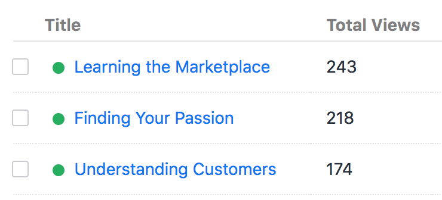

View Count plugin for Craft CMS
===============================

Count the number of times an element has been viewed.



***

## Track views via Twig, PHP, or AJAX

Basic tracking looks like this...

```twig

```

However, there are several more advanced ways to [increment a view counter](https://plugins.doublesecretagency.com/view-count/how-to-increment-the-counter/).

## Allow multiple counters on the same element

If you need to track multiple aspects of the same element, it's easy to do so! Simply specify an [optional key](https://plugins.doublesecretagency.com/view-count/using-a-unique-key/) when setting up the tracking mechanism.

## Sort by "most viewed"

Once you've started logging views, you'll likely want to know which items have been [viewed the most...](https://plugins.doublesecretagency.com/view-count/sort-by-most-viewed/)

```twig


```

## Display view totals in the control panel

You can add a ["Total Views" field](https://plugins.doublesecretagency.com/view-count/total-views-fieldtype/), which displays a read-only total for each element.

## Events

They do [exactly what you think...](https://plugins.doublesecretagency.com/view-count/events/)

 - EVENT_BEFORE_VIEW
 - EVENT_AFTER_VIEW
 
Within the `EVENT_BEFORE_VIEW` event, you can prevent the view from being counted.

***

## Anything else?

We've got other plugins too!

Check out the full catalog at [doublesecretagency.com/plugins](https://www.doublesecretagency.com/plugins)
